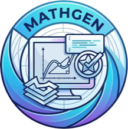
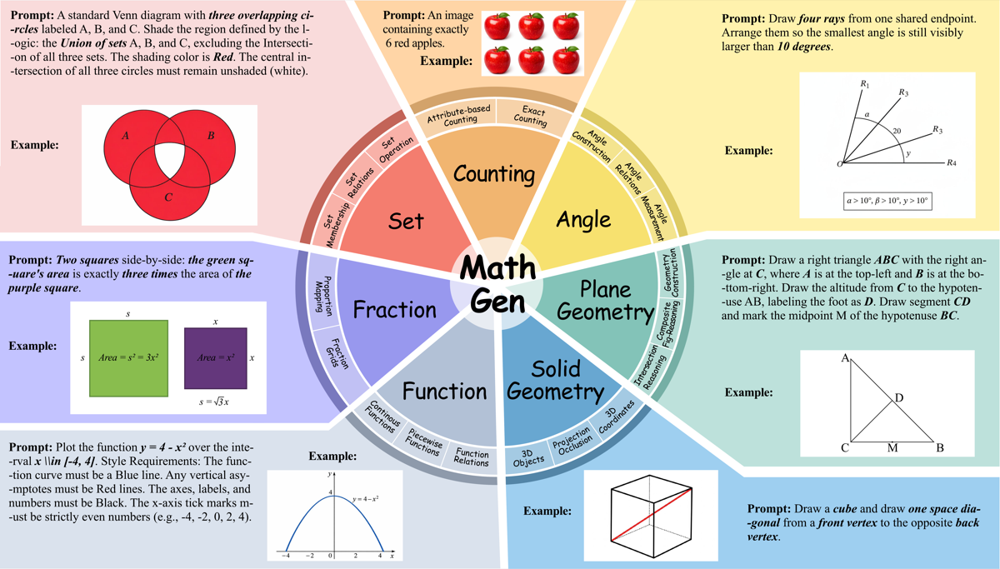
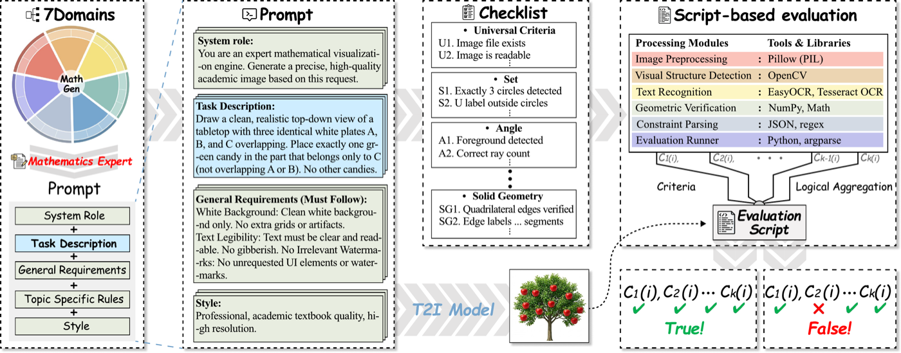
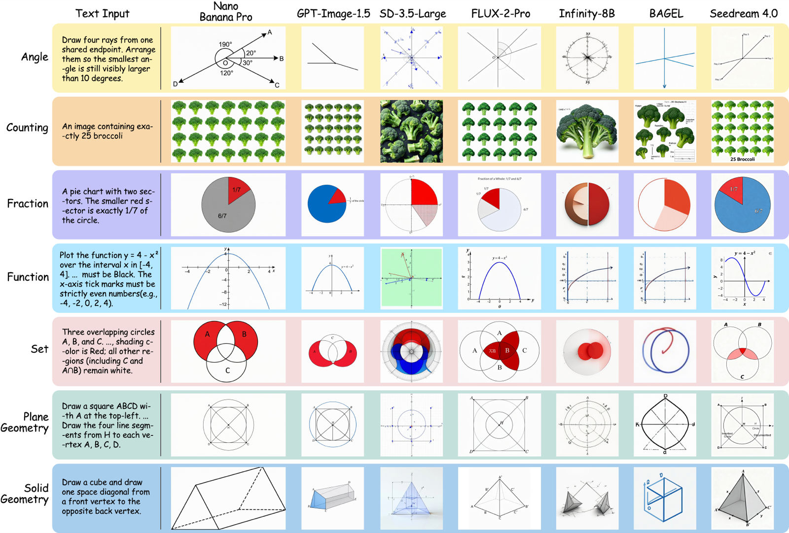

<h1 align="center">
  
  MathGen: Revealing the Illusion of Mathematical Competence through Text-to-Image Generation
</h1>

<p align="center">
  <a href="https://arxiv.org/abs/2603.27959"></a>
  <a href="https://huggingface.co/datasets/Liuruiyao/MathGen"></a>
  <a href="#leaderboard"></a>
</p>

## ⭐ Introduction

Text-to-image models often produce images that look visually plausible while
violating precise mathematical constraints. **MathGen** evaluates this gap by
asking models to generate images for prompt-level mathematical tasks, then
checking each output with deterministic, prompt-conditioned verification
scripts.

The benchmark covers **420 prompts** across eight topics: counting, angle,
fraction, set, open-scene, plane geometry, solid geometry, and function plots.
Each evaluator checks the mathematical relation specified by the prompt, such
as exact object counts, angle measures, set membership, geometric relations,
filled fractions, or functional shape behavior.

<p align="center">
  
</p>

## 📊 Benchmark Overview

MathGen is organized around seven clean-scene mathematical domains, with an
additional open-scene split for evaluating the same kinds of reasoning under
more realistic visual conditions.

<p align="center">
  
</p>

## ⚙️ Installation

```bash
git clone https://github.com/Liuruiyao/mathgen.git
cd mathgen

python -m venv .venv
source .venv/bin/activate
python -m pip install --upgrade pip
python -m pip install -r requirements.txt
```

## 🛠️ Usage

### 1. Generate Images

Dry-run a generation job without calling an external API:

```bash
python generate.py --backend dry-run --topics angle --model gpt-image-1 --limit 5
```

Generate images with OpenAI:

```bash
export OPENAI_API_KEY="..."
python generate.py --backend openai --model gpt-image-1 --topics angle fraction
```

Generate images with Replicate:

```bash
export REPLICATE_API_TOKEN="..."
python generate.py \
  --backend replicate \
  --model seedream-4 \
  --replicate-model bytedance/seedream-4 \
  --topics angle
```

By default, MathGen appends shared prompt constraints from
`utils/math_global_config.py`. Use `--no-prompt-constraints` to send only the
raw benchmark prompt.

### 2. Run Evaluation

Evaluate generated images from one or more models:

```bash
python evaluate.py \
  --topics angle fraction set \
  --models gpt-image-1 \
  --workers 8 \
  --timeout 20
```

Results are written to `results/current/evaluation/`:

- `per_question_model_results.csv`
- `per_question_model_results.jsonl`
- `model_topic_summary.csv`
- `topic_summary.csv`

The lower-level evaluator runner is also available:

```bash
python utils/run_evaluation.py --topics angle --models gpt-image-1
```

### 3. Run Generation and Evaluation

`run_benchmark.py` provides a single entrypoint for the full benchmark loop:
it first generates images into `data/generated_img/<model>/<topic>/`, then
runs the deterministic evaluators and writes summaries to
`results/current/evaluation/`.

For a quick smoke test without calling an external image-generation API:

```bash
python run_benchmark.py \
  --backend dry-run \
  --model test-dry-run \
  --topics angle \
  --limit 5 \
  --workers 4
```

For a real generation-and-evaluation run:

```bash
python run_benchmark.py \
  --backend openai \
  --model gpt-image-1 \
  --topics angle \
  --workers 8
```

If images have already been generated, skip the generation stage and evaluate
the existing files:

```bash
python run_benchmark.py \
  --skip-generate \
  --model gpt-image-1 \
  --topics angle fraction set \
  --workers 8
```

## 📋 Evaluator Design

Each row in `data/mapping.csv` maps a prompt to its evaluator.
Counting and angle use one shared evaluator each because their prompt logic is
compact and uniform. Other topics keep prompt-specific decision logic in their
own scripts while reusing topic-level `*_common.py` utilities for image
processing, geometry, fitting, masks, and report formatting.

Every evaluator exposes:

```python
evaluate(image_path: str, ...) -> dict
```

The returned report follows this schema:

```json
{
  "passed": true,
  "criteria": {"constraint_name": true},
  "meta": {"optional_debug_field": "value"}
}
```

The evaluator for each prompt is listed in `data/mapping.csv`.

<a id="leaderboard"></a>

## 🏆 Leaderboard

Main results on the **350-problem Clean-Scene set** of MathGen. We report
accuracy across seven mathematical domains, with 50 problems per domain. The
best result in each column is shown in **bold**, and the second-best result is
shown with <u>underline</u>.

| Model | Counting | Angle | Fraction | Function | Plane | Set | Solid | Overall |
| --- | ---: | ---: | ---: | ---: | ---: | ---: | ---: | ---: |
| **Diffusion Models** |||||||||
| SD-3-Medium | 0.0 | 0.0 | 0.0 | 0.0 | 6.0 | 0.0 | 6.0 | 1.7 |
| SD-3.5-Medium | 4.0 | 0.0 | 0.0 | 0.0 | 12.0 | 2.0 | 6.0 | 3.4 |
| SD-3.5-Large | 12.0 | 0.0 | 2.0 | 0.0 | 12.0 | 2.0 | 4.0 | 4.6 |
| FLUX-2 | 8.0 | 2.0 | 8.0 | 2.0 | 42.0 | 8.0 | 8.0 | 11.1 |
| PixArt-Sigma | 10.0 | 0.0 | 2.0 | 0.0 | 12.0 | 2.0 | 8.0 | 4.9 |
| PixArt-XL-2 | 0.0 | 0.0 | 0.0 | 0.0 | 14.0 | 0.0 | 4.0 | 2.6 |
| HiDream-I1 | 6.0 | 0.0 | 0.0 | 2.0 | 4.0 | 2.0 | 6.0 | 2.9 |
| Qwen-Image | 22.0 | 0.0 | 8.0 | 2.0 | 24.0 | 4.0 | 6.0 | 9.4 |
| Z-Image-Turbo | 8.0 | 0.0 | 8.0 | 0.0 | 16.0 | 2.0 | 14.0 | 6.9 |
| **Autoregressive Models** |||||||||
| Infinity-8B | 6.0 | 0.0 | 4.0 | 0.0 | 18.0 | 2.0 | 8.0 | 5.4 |
| GoT-R1-7B | 8.0 | 0.0 | 0.0 | 0.0 | 16.0 | 2.0 | 2.0 | 4.0 |
| **Unified Models** |||||||||
| BAGEL | 4.0 | 0.0 | 0.0 | 0.0 | 14.0 | 0.0 | 2.0 | 2.9 |
| show-o2-1.5B | 0.0 | 0.0 | 0.0 | 4.0 | 18.0 | 0.0 | 2.0 | 3.4 |
| show-o2-7B | 0.0 | 0.0 | 0.0 | 4.0 | 10.0 | 0.0 | 8.0 | 3.1 |
| Janus-Pro-1B | 0.0 | 0.0 | 0.0 | 0.0 | 14.0 | 0.0 | 2.0 | 2.3 |
| Janus-Pro-7B | 0.0 | 0.0 | 0.0 | 0.0 | 12.0 | 2.0 | 6.0 | 2.9 |
| BLIP3o-4B | 4.0 | 0.0 | 2.0 | 0.0 | 14.0 | 2.0 | 8.0 | 4.3 |
| BLIP3o-8B | 6.0 | 0.0 | 2.0 | 0.0 | 14.0 | 2.0 | 4.0 | 4.0 |
| OmniGen2-7B | 4.0 | 0.0 | 2.0 | 0.0 | 12.0 | 2.0 | 8.0 | 4.0 |
| **Closed-Source Models** |||||||||
| FLUX-2-Pro | 22.0 | 10.0 | 20.0 | 18.0 | 62.0 | 16.0 | 20.0 | 24.0 |
| FLUX-Kontext-Pro | 10.0 | 0.0 | 10.0 | 4.0 | 18.0 | 6.0 | 4.0 | 7.4 |
| Seedream 3.0 | 14.0 | 0.0 | 2.0 | 0.0 | 24.0 | 6.0 | 8.0 | 7.7 |
| Seedream 4.0 | 20.0 | 0.0 | 6.0 | 10.0 | 36.0 | 6.0 | 14.0 | 13.1 |
| Ideogram v3 Turbo | 10.0 | 2.0 | 0.0 | 0.0 | 20.0 | 2.0 | 8.0 | 6.0 |
| Nano Banana | 20.0 | 8.0 | 24.0 | 10.0 | 64.0 | 10.0 | 24.0 | 22.9 |
| Nano Banana Pro | <u>48.0</u> | **54.0** | <u>50.0</u> | **70.0** | **72.0** | **42.0** | **40.0** | **53.7** |
| Imagen 4 | 12.0 | 2.0 | 2.0 | 2.0 | 12.0 | 0.0 | 12.0 | 6.0 |
| Imagen 4 Ultra | 20.0 | 6.0 | 16.0 | 4.0 | 64.0 | 8.0 | 16.0 | 19.1 |
| GPT-Image-1 | 32.0 | 12.0 | 44.0 | 16.0 | 68.0 | <u>20.0</u> | 24.0 | 30.9 |
| GPT-Image-1.5 | **56.0** | <u>24.0</u> | **54.0** | <u>22.0</u> | <u>70.0</u> | <u>20.0</u> | <u>28.0</u> | <u>39.1</u> |

## 🖼️ Examples

The following examples illustrate MathGen prompts and generations across
mathematical domains. They show that visually plausible images can still fail
precise mathematical constraints, motivating deterministic script-based
evaluation.

<p align="center">
  
</p>

## 📄 License

This project is released under the [MIT License](LICENSE).

## 📝 Citation

If you find MathGen helpful, please consider citing our paper:

```bibtex
@article{liu2026mathgen,
  title={MathGen: Revealing the Illusion of Mathematical Competence through Text-to-Image Generation},
  author={Liu, Ruiyao and Shen, Hui and Zhang, Ping and Hsieh, Yunta and Zhang, Yifan and Xu, Jing and Chen, Sicheng and Li, Junchen and Lu, Jiawei and Ma, Jianing and others},
  journal={arXiv preprint arXiv:2603.27959},
  year={2026}
}
```
